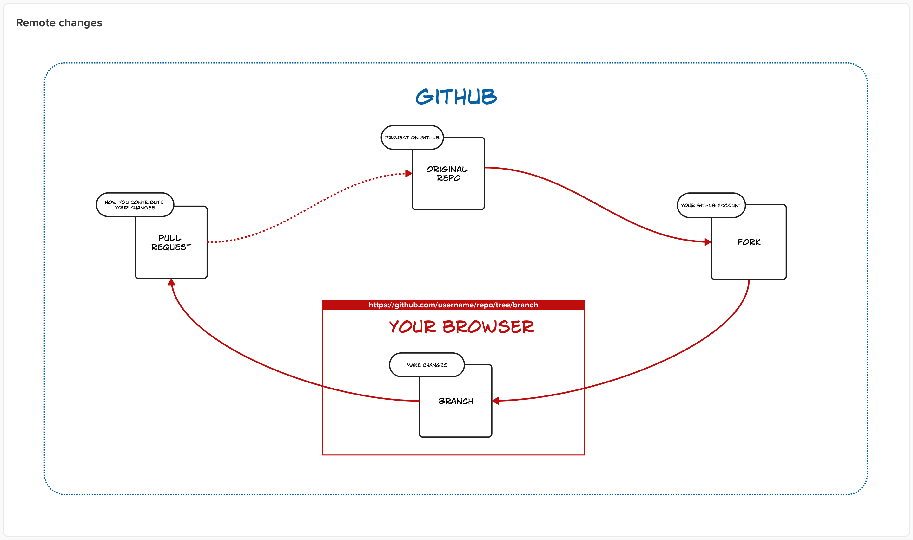

# 5. Working with media

[Git for designers](../README.md) → 5. Working with media

⚠️ Document status: **Draft**

## Add media to your repo

Adding media to your repo is the best way to keep everything together and under version control. We recommend this approach!

It is a good idea to create a dedicated directory (folder) to contain your media files. 

[add instructional steps here]

The trickiest part about adding media to your repo is knowing the correct syntax to use to embed the image in your Markdown files.

In Markdown an image reference looks like this:

```

```

The two dots in the file path in parentheses means go back/up one level in the folder hierarchy. Here’s an actual example:

```

```

Which produces:



## Other ways to add media

(details to follow)

## Topic navigation

*	Next topic: [6. Resolving merge conflicts](6-resolve-merge-conflicts.md)
*	This topic: **5. Working with media**
*	Previous topic: [4. Sync fork from original](4-sync-from-original.md)
